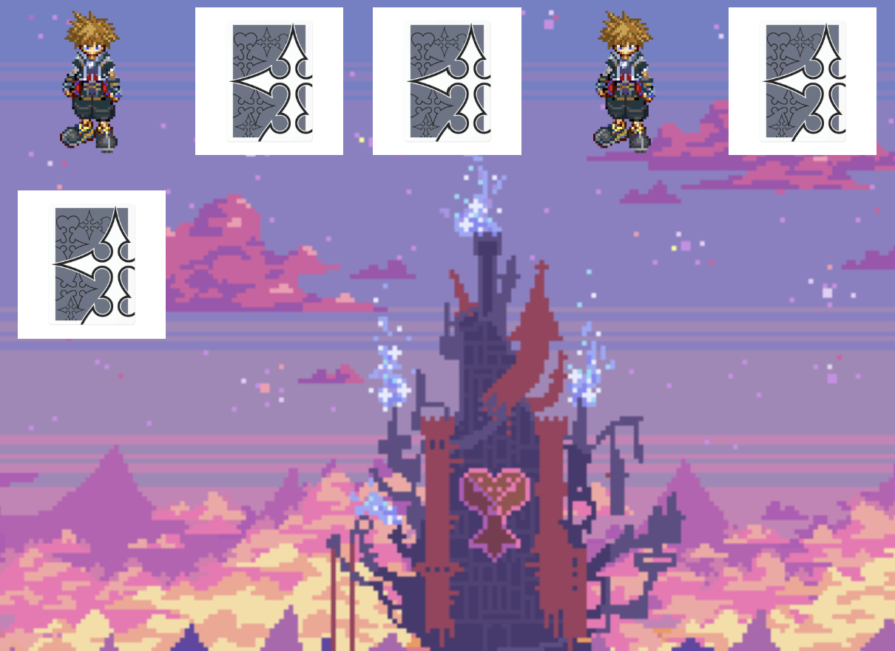

                            ✨ Projet Personnel : Jeu des Paires avec HTML, CSS et JavaScript ✨


 


## ✏️ Description
Ce projet est un jeu des paires développé en HTML, CSS et JavaScript. Le jeu consiste à retourner des cartes pour trouver les paires correspondantes. Le joueur retourne deux cartes, et le jeu vérifie si elles forment une paire. Si c'est le cas, les cartes restent face visible, sinon elles se retournent de nouveau. L'objectif principal de cet exercice est de gérer la logique du jeu avec JavaScript, tout en assurant une expérience utilisateur fluide et intuitive grâce à des animations CSS.

## 💻 Technologies utilisées
**HTML5** : Pour la structure de la page et l'affichage des cartes.

**CSS3** : Pour le style des cartes, les animations de retournement, et la mise en page générale.

**JavaScript** : Pour la logique du jeu, notamment la gestion des clics, la vérification des paires, et le contrôle du retournement des cartes.
## Caractéristiques principales 🚀
🎯 Retourner les cartes de manière fluide :
Les cartes peuvent être retournées de façon fluide grâce à des animations CSS, créant une transition agréable pour l'utilisateur.

🎨 Vérification des paires :
Lorsque deux cartes sont retournées, le script JavaScript vérifie si elles correspondent. Si elles forment une paire, elles restent face visible, sinon elles se retournent automatiquement après un court délai.

🔄 Gestion de la logique en JavaScript :
Toute la logique du jeu, y compris la gestion des événements de clic et le contrôle des paires, est gérée en JavaScript, permettant de renforcer les compétences en manipulation du DOM et en logique conditionnelle.

🧑‍🏫 Objectif pédagogique :
Ce projet a pour but de maîtriser la logique de jeu en JavaScript, de perfectionner la manipulation du DOM, et d'améliorer la gestion des états et des événements utilisateur.

##Lien:

[ICI](https://pair-game-two.vercel.app/)

## 🛠️ Installation & Utilisation
1. Cloner le dépôt :


```
git clone https://github.com/BertrandM22/PairGame
```

2. Ouvrir le projet :
Ouvre le fichier index.html dans ton navigateur préféré pour jouer au jeu
